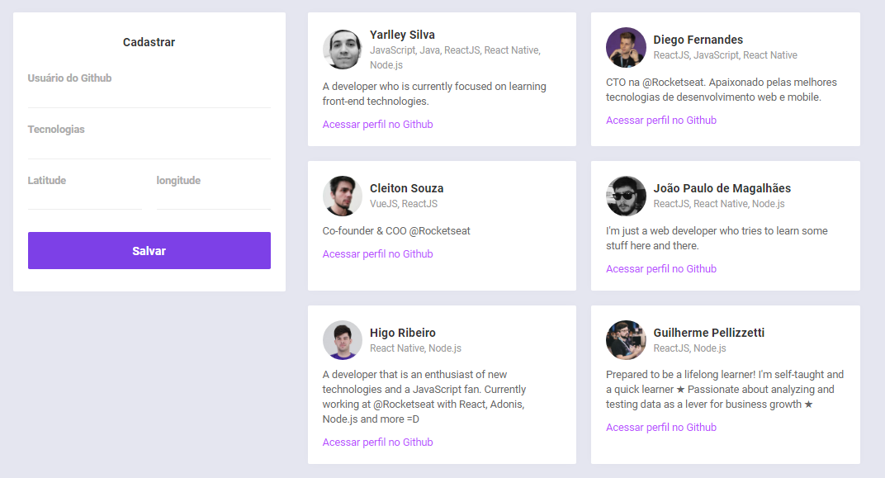

#  Semana OmniStack 10 da  [Rocketseat](https://rocketseat.com.br "Rocketseat") 🚀

### Sobre o DevRadar

A ideia do <strong>DevRadar</strong> é:

<strong>"Encontrar outros desenvolvedores próximos a você que utilizam a mesma ou outra Stack.".</strong>

O projeto consiste na construção de uma aplicação completa para encontrar outros desenvolvedores. No qual foi construido o BackEnd e as versões Web e Mobile.

### 💻 Tecnologias

- [NodeJS](https://nodejs.org/en/)
- [ReactJS](https://pt-br.reactjs.org)
- [React Native](https://reactnative.dev)
- [MongoDB](https://www.mongodb.com)
- [Mongoose](https://nodemon.io)
- [Axios](https://github.com/axios/axios)

### Tela Web/FrontEnd.

<h1 align="center">
    
</h1>

###  Requerimentos / Dependências

Para instalar todoas as dependências execute em cada terminal de cada pasta:

`yarn install`

### Como usar

<strong>BackEnd</strong>: Execute no terminal `yarn dev` para iniciar o servidor;

<strong>FrontEnd</strong>: Execute no terminal `yarn start` para iniciar a versão WEB, em seguida acesse o <strong>localhost</strong> na porta <strong>3333</strong>.

<strong>Mobile</strong>: Execute no terminal `yarn start` para iniciar a versão Mobile - <strong>Necessário utilizar o EXPO</strong>;

### Contato

Contato: - yarlley.silva@gmail.com
 
LinkedIn - https://www.linkedin.com/in/yarlleysilva/
